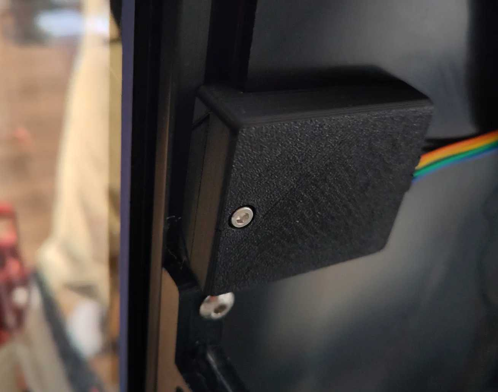

<!--
SPDX-FileCopyrightText: 2024 Sebastian Andersson <sebastian@bittr.nu>

SPDX-License-Identifier: GPL-3.0-or-later
-->

[](https://api.reuse.software/info/github.com/bofh69/nfc2klipper)


# nfc2klipper

<p>
Automatically sets the loaded spool &amp; filament in klipper by using NFC/RFID tags.


</p>

- Table of Contents
  - [Prepare for running nfc2klipper](#prepare-for-running-nfc2klipper)
  - [Preparing an NFC reader](#preparing-an-nfc-reader)
    - [PN532 bug in the nfcpy module](#pn532-bug-in-the-nfcpy-module)
  - [Preparing klipper](#preparing-klipper)
  - [Preparing the slicer](#preparing-the-slicer)
  - [Preparing tags](#preparing-tags)
    - [Using tag's id](#using-tags-id)
    - [SPOOL & FILAMENT in tags](#spool--filament-in-tags)
      - [Write tags with the **extperimental** web server](#write-tags-with-the-extperimental-web-server)
      - [Write with an app](#write-with-an-app)
      - [Write with console application](#write-with-console-application)
  - [Run automatically with systemd](#run-automatically-with-systemd)
  - [Automatic upgrades with moonraker](#automatic-upgrades-with-moonraker)
  - [See also](#see-also)
  - [Developer info](#developer-info)


## Prepare for running nfc2klipper

In the cloned repository's dir run:
```sh
virtualenv venv
venv/bin/pip3 install -r requirements.txt
```

Copy and update the `nfc2klipper.cfg` to `~/.config/nfc2klipper/nfc2klipper.cfg`.

## Preparing an NFC reader

I use a PN532 based reader (Elechouse PN532 NFC RFID Module V3, if you
want to use the same) connected via UART to the raspberry pi where this
program is running.


Many pages suggest connecting its VCC pin to 5V on the RPi. Don't!
It can run from 3.3V and then it won't risk slowly destroying the RPi's
GPIO pins.


See [here](https://learn.adafruit.com/adafruit-nfc-rfid-on-raspberry-pi/pi-serial-port)
for how to configure a raspberry pi for it (but change VCC pin...).

Run `sudo rpi-update` to avoid problems with older firmware on the pi.

There is a model for attaching it to the printer
[here](https://www.printables.com/model/798929-elechouse-pn532-v3-nfc-holder-for-voron-for-spoolm).


### PN532 bug in the nfcpy module

When running it on a raspberry pi's mini-uart (ttyS0 as device), it works fine.
When using the other UART (ttyAMA0), I can only run the programs once.
I have to power cycle the PN532 to get them to run again. Just rebooting
the pi doesn't help.

This seems to be due to a bug in nfcpy (version 1.0.4),
see (https://github.com/nfcpy/nfcpy/issues/186).

A workaround that works for me is to change
`venv/lib/python3.*/site-packages/nfc/clf/pn532.py`
around line 390, from:

```python
        change_baudrate = True  # try higher speeds
```

to:

```python
        change_baudrate = False  # try higher speeds
```

There is an included patch file that can be applied:
```sh
patch -p6 venv/lib/python3.*/site-packages/nfc/clf/pn532.py < pn532.py.patch
```


## Preparing klipper

When a tag has been read, it will send these gcodes to Klipper:

* `SET_ACTIVE_FILAMENT ID=n1`
* `SET_ACTIVE_SPOOL ID=n2`


See [klipper-spoolman.cfg](klipper-spoolman.cfg) for the klipper
config for them. Klipper must also have a `[save-variables]` section
in its config, see
[Klipper's documentation](https://www.klipper3d.org/Config_Reference.html#save_variables).


## Preparing the slicer

For every filament, add a custom start gcode that calls:

`ASSERT_ACTIVE_FILAMENT ID=<id>`

where `<id>` is its filament id in Spoolman.

This can be done automatically by using [spoolman2slicer](https://github.com/bofh69/spoolman2slicer).


## Preparing tags

Tags can either contain custom data for nfc2klipper, or the tags'
id can be used to lookup the spool in Spoolman.

The first method allows the system to work even if spoolman isn't
working for the moment. The built in web server can also be used
to write the data to new tags.

The second method allows nfc2klipper to be used with
[FilaMan](https://github.com/ManuelW77/Filaman) and with manufacturers'
tags with different format. There is not yet a function to
update Spoolman's spool with the tag's id.


### Using tag's id

Add an extra field in Spoolman for the spools called `nfc_id`.

If not done by FilaMan, add the tags' identifier to the spools' `nfc_id` field with Spoolman's web pages.
The id can be read in nfc2klipper's logs. It writes it there after
reading the tag.


### SPOOL & FILAMENT in tags

The tags should contain an NDEF record with a text block like this:
```
SPOOL:3
FILAMENT:2
```

The numbers are the id numbers that will be sent to the macros in
klipper via the [Moonraker](https://github.com/Arksine/moonraker) API.

#### Write tags with the **extperimental** web server

It is possible to enable an **experimental** web server in `nfc2klipper.py`.
It will then serve a web page for writing to the tags.
The default address will be `http://mainsailos.local:5001/`,
where `mainsailos.local` should be replaced with the computer's name (or IP address).

The program uses a development web server with **no security** at all so it
shouldn't be run if the computer is running on an untrusted network.

The program has a configuration file (`~/.config/nfc2klipper/nfc2klipper.cfg`) for
enabling the web server, setting the port number, addresses to moonraker
and mainsail, the webserver's address and NFC device to use.


#### Write with an app

There is an Android app, [Spoolman Companion](https://github.com/V-aruu/SpoolCompanion), for writing
to the tags.

#### Write with console application

The `write_tags.py` program fetches Spoolman's spools, shows a simple
text interface where the spool can be chosen, and when pressing return,
writes to the tag.

Use the `write_tag` script to stop the nfc2klipper service, run the
`write_tags.py` program and then start the service again after.


## Run automatically with systemd

Copy nfc2klippper.service to `/etc/systemd/system`, then run:

```sh
sudo systemctl start nfc2klipper
sudo systemctl enable nfc2klipper
```

To see its status, run:
```sh
sudo systemctl status nfc2klipper
```

## Automatic upgrades with moonraker

Moonraker can be configured to help upgrade nfc2klipper.

Copy the the `moonraker-nfc2klipper.cfg` file to the same dir as where
`moonraker.conf` is. Include the config file by adding:
```toml
[include moonraker-nfc2klipper.cfg]
```

## See also
If nfc2klipper doesn't work for some reason, [spool2klipper](https://github.com/bofh69/spool2klipper) can be use to automatically update the `active_filament` variable whenever the spool is changed in Moonraker (when changing it in the frontend for example). That way `ASSERT_ACTIVE_FILAMENT` will still work correctly.

## Developer info

Pull requests are happily accepted, but before making one make sure
the code is formatted correctly and linted without errors.

Format the code by running `make fmt` and lint it with `make lint`.
