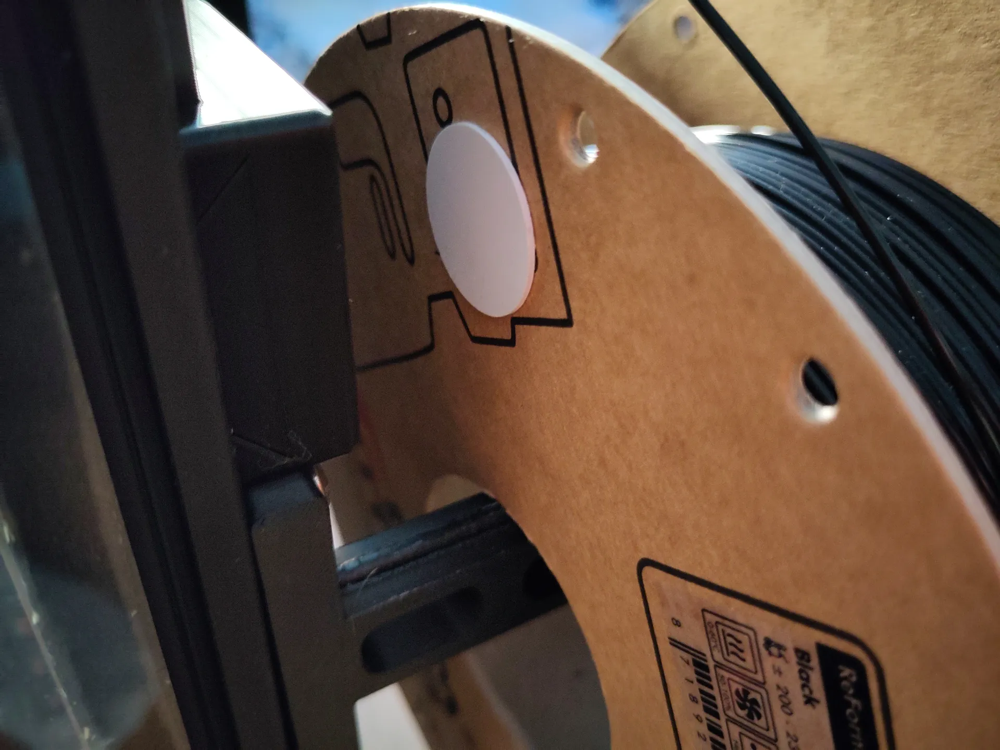

<!--
-SPDX-FileCopyrightText: 2025 Sebastian Andersson <sebastian@bittr.nu>
-
-SPDX-License-Identifier: GPL-3.0-or-later
--->

# nfc2klipper

[](https://api.reuse.software/info/github.com/bofh69/nfc2klipper)


<p>

<div> Automatically integrates Spoolman and Klipper by using NFC/RFID tags on filament spools.
This project makes it easy to manage and track filament usage with your 3D printer.
</div>

</p>

---

## Key Features
- **NFC/RFID Integration**: Automatically detects and sets the loaded spool's id in Klipper.
- **Flexible Tag Formats**: Supports both custom data and manufacturer tags.
- **Ease of Use**: Includes an experimental web server and there is an Android app for writing tags.
- **Automation**: Systemd support for automatic startup and Moonraker integration for easy upgrades.


## Table of Contents
- [Installation](#installation)
- [Preparing Hardware](#preparing-hardware)
  - [NFC Reader Setup](#nfc-reader-setup)
  - [PN532 Bug Fix](#pn532-bug-fix)
- [Klipper Configuration](#klipper-configuration)
- [Slicer Configuration](#slicer-configuration)
- [Tag Preparation](#tag-preparation)
  - [Using Tag IDs](#using-tag-ids)
  - [Storing Spool & Filament Data](#storing-spool--filament-data)
- [Automation](#automation)
  - [Systemd Setup](#systemd-setup)
  - [Moonraker Upgrades](#moonraker-upgrades)
- [Additional Resources](#additional-resources)
- [Developer Guide](#developer-guide)
- [License](#license)

## Installation
1. Clone this repository:
   ```sh
   git clone https://github.com/bofh69/nfc2klipper.git
   cd nfc2klipper
   ```
2. Create a virtual environment and install dependencies:
   ```sh
   virtualenv venv
   venv/bin/pip3 install -r requirements.txt
   ```
3. Copy the configuration file and update it as needed:
   ```sh
   cp nfc2klipper.cfg ~/.config/nfc2klipper/nfc2klipper.cfg
   ```

## Preparing Hardware

### NFC Reader Setup
- Use a `nfcpy` supported reader. I use the Elechouse PN532 NFC RFID Module V3.
- Connect the reader to your Raspberry Pi. I use a UART port.
- IMPORTANT: Power the reader from the 3.3V pin to avoid damaging the Raspberry Pi GPIO.

For installation details, see [Adafruit's guide](https://learn.adafruit.com/adafruit-nfc-rfid-on-raspberry-pi/pi-serial-port). Note to adjust the VCC pin configuration.

A printable model for mounting that NFC reader to a 2020 profile is available
[here](https://www.printables.com/model/798929-elechouse-pn532-v3-nfc-holder-for-voron-for-spoolm).

### pynfc Bug Fix

There is a bug in pynfc (v1.0.4) that may affect the PN532 reader so it
has to be power-cycled after running nfc2klipper. See (https://github.com/nfcpy/nfcpy/issues/186).

Included is a patch that fixes that problem. Apply the included patch as follows:
```sh
patch -p6 venv/lib/python3.*/site-packages/nfc/clf/pn532.py < pn532.py.patch
```

## Klipper Configuration
nfc2klipper will call the following G-code macros in Klipper:
- `SET_ACTIVE_FILAMENT ID`
- `SET_ACTIVE_SPOOL ID`

There are definitions for them in `klipper-spoolman.cfg`.

Ensure your Klipper configuration includes the `[save-variables]` section for them to work:
- [Klipper Save Variables Documentation](https://www.klipper3d.org/Config_Reference.html#save_variables)


## Slicer Configuration
I use the following custom start G-code setting for my filaments in the slicers:
```gcode
ASSERT_ACTIVE_FILAMENT ID=<filament id>
```
It verifies that the right filament is loaded and, if not, pauses the print.

The slicer configuration can be automated with
[spoolman2slicer](https://github.com/bofh69/spoolman2slicer).

## Tag Preparation

nfc2klipper first checks the tags for a custom format with the filament and spool
ids in it, described below. If not found, the tag's id is used to search for the spool in Spoolman.

### Using Tag IDs
- Add an `nfc_id` field as an "extra" field to the spools in Spoolman.
- Update the `nfc_id` field with the tag's identifier, which is displayed in the nfc2klipper logs.

This is the same extra field in Spoolman as Filaman uses, so tags written by Filaman should just work.

### Storing Spool & Filament Data
Tags should contain an NDEF text record in the following format:
```
SPOOL:3
FILAMENT:2
```

#### Writing Tags
1. **Web Server**: Enable the experimental web server in `nfc2klipper.py` and access it at `http://<hostname>:5001/`.
2. **Android App**: Use [Spoolman Companion](https://github.com/V-aruu/SpoolCompanion) to write tags.
3. **Console Script**: Use the `write_tags.py` script to write data to tags.

Please note that the webserver isn't production ready and should never be used on unsecure networks.

The web page lists the current spools in Spoolman.
By pressing the "Write" button, its info is written to the nfc/rfid tag.
By pressing the "Set in Spoolman" button, the tag's id is set for that
Spool in Spoolman.


## Automation

### Systemd Setup
To run `nfc2klipper` as a service:
1. Copy the service file:
   ```sh
   sudo cp nfc2klipper.service /etc/systemd/system/
   ```
2. Start and enable the service:
   ```sh
   sudo systemctl start nfc2klipper
   sudo systemctl enable nfc2klipper
   ```

You can then view its logs with `journeyctl` or `systemctl`.

### Moonraker Upgrades
Configure Moonraker for automatic upgrades:
1. Copy `moonraker-nfc2klipper.cfg` to the Moonraker configuration directory.
2. Include the file in `moonraker.conf`:
   ```toml
   [include moonraker-nfc2klipper.cfg]
   ```

## Additional Resources
- [spool2klipper](https://github.com/bofh69/spool2klipper) 
- [spoolman2slicer](https://github.com/bofh69/spoolman2slicer) 

## Developer Guide
Pull requests are welcome! Before submitting, ensure the code is formatted, linted and has copyright info:
```sh
make fmt
make lint
make reuse
```

## License
This project is licensed under the [GPL-3.0 License](https://www.gnu.org/licenses/gpl-3.0.html).
